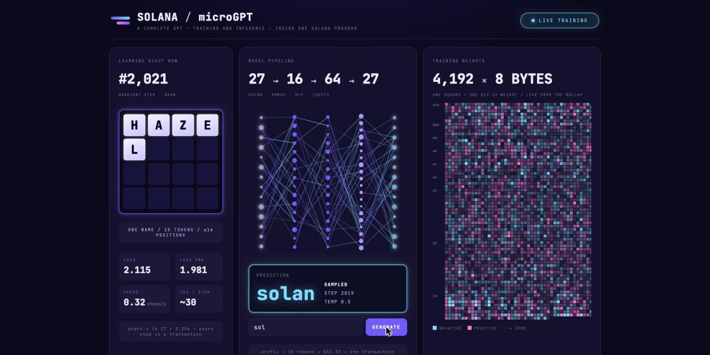
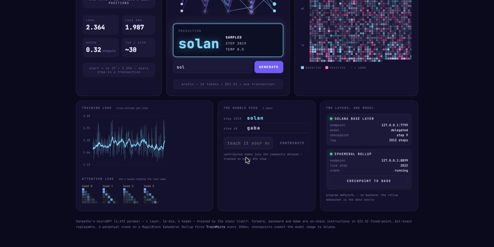

# p-gpt — a GPT that lives, and learns, inside Solana



**p-gpt trains Karpathy's [microGPT](https://gist.github.com/karpathy/8627fe009c40f57531cb18360106ce95)
(4,192 parameters) inside the Solana runtime.** Forward pass, backward pass and
Adam are on-chain instructions in deterministic Q32.32 fixed-point. Training runs
*perpetually* on a [MagicBlock Ephemeral Rollup](https://docs.magicblock.gg)
through an on-chain crank — there is no server anywhere — and the model
checkpoints itself back to the Solana base layer. Every gradient step is a
transaction; the weights account *is* the tensor.

It is a [pinocchio](https://github.com/anza-xyz/pinocchio) program written in
[p-token](https://github.com/febo/p-token) style: `no_std`, zero-copy
`#[repr(C)]` state, one processor file per instruction. The whole thing —
math core, program, client, rollup integration, dashboard — is about 5K lines.

## What you're looking at

The dashboard reads chain state only (the rollup's websocket is the backend):

- **Learning right now** — the gradient step counter and the *actual name the
  model is training on at this moment*, as letter tiles decoded from the model
  header. During the forward phase the letter being predicted lights up.
- **Model pipeline** — `27 → 16 → 64 → 27` (vocab → embed → MLP → logits); the
  edges pulse on every landed step. Type a prefix and the chain completes it.
- **Training weights** — all 4,192 parameters, one square per Q32.32 weight,
  repainted live. Cyan negative, pink positive. Watch noise turn into structure.



Below the fold: the loss curve (raw + smoothed), the **attention lens** (the
four heads' causal attention over the last generated name, read from the
on-chain generation workspace), the **babble feed** of everything the model
has ever named, a box to *teach it your name* (contributions join the training
set every 8th step), and the two-layer panel showing the base-layer checkpoint
lagging the live rollup step.

## How it works

```
gpt-core/        the model: fwd/bwd/Adam in Q32.32 fixed-point (no_std, zero deps)
interface/       account layouts, PDA seeds, instruction encoding
program/         the pinocchio program (+ mollusk tests & CU benches)
clients/ts/      TypeScript client + CLI
app/             the dashboard (Vite + React, no backend)
localnet/        base layer + ephemeral rollup, one script
tools/parity/    f64-reference lockstep verification
reference/       vendored microgpt.py + names.txt
```

**The model** is microGPT exactly: 1 transformer layer, n_embd 16, 4 heads,
block size 16, vocab 27 (a–z + BOS), RMSNorm, ReLU MLP, no biases, Adam with
bias correction. The only deviation is the learning-rate schedule, which
floors instead of decaying to zero so training can run forever.

**Numerics.** Everything is Q32.32 fixed-point (`i64`), which makes the model
bit-exact replayable: seed + transaction history ⇒ the exact weights. The
backward pass is hand-derived (no autograd), verified against finite
differences and against an f64 port of the reference. Fixed-point loss at 1000
steps is **2.366 vs 2.369** for the f64 reference (upstream microGPT ≈ 2.3).

**Training on-chain.** A full SGD step is split into micro-ops that each fit
the compute a rollup crank tick gets: one forward position, one backward
position, or a 256-parameter Adam chunk. A phase state machine in the model
header sequences them; a step lands every ~35 transactions. The split path
produces **bit-identical weights** to the fused single-instruction step (the
test suite asserts it). The same micro-ops run on vanilla L1 too — the base
layer *can* train it; the rollup just does it perpetually and for free.

**The rollup.** Accounts are delegated to the ER; the ER's task scheduler
fires `TrainMicro` every 100 ms forever. `Checkpoint` copies the model image
into four sub-10KB shard accounts and commits them to the base layer;
`Undelegate` brings the committable accounts home. Generation and
contribution work on whichever layer currently owns the state.

| instruction (mollusk, measured) | CU |
|---|---|
| `TrainMicro` — pick doc / forward position / backward position | ~7K / ~65K / ~97K |
| `TrainMicro` — Adam chunk (256 params) | ~247K |
| `TrainStep` (fused; needs a raised-limit runtime) | ~4.8M |
| `Generate` (worst case, 16 tokens) | ~834K |

The SBF cost model shaped the math: no 128-bit division anywhere hot (softmax
normalizes by reciprocal, RMSNorm uses multiply-only Newton rsqrt, exp is a
6-bit-LUT 2^x), Q16.16-truncated native multiplies in the matmul kernels with
2^12 loss scaling so gradients survive, and `inline(never)` frame discipline
because SBF stack frames are 4KB and overflow silently.

## Run it

Prerequisites: Rust + `cargo build-sbf` (Solana platform tools), the Solana
CLI (`solana-test-validator`), Node ≥ 20, and MagicBlock's
`ephemeral-validator` (`npm i -g @magicblock-labs/ephemeral-validator`).

```bash
# 1. build the program
cargo build-sbf --manifest-path program/Cargo.toml

# 2. boot the localnet: base layer on :7799, ephemeral rollup on :8899
localnet/run.sh                       # keep it running in its own terminal

# 3. create the model on-chain, init weights, load the names dataset
cd clients/ts && npm install
npm run cli -- setup                  # ~700 base-layer transactions, a few minutes
npm run cli -- train 3                # 3 SGD steps on the BASE layer
npm run cli -- delegate               # hand the model to the ephemeral rollup
npm run cli -- schedule 100           # start the perpetual crank — it trains itself now
npm run cli -- watch                  # stream loss + generations
npm run cli -- generate sol           # ask the chain for a name
npm run cli -- contribute yourname    # teach it
npm run cli -- checkpoint             # commit the model image to the base layer
npm run cli -- status                 # base vs rollup

# 4. the dashboard
cd ../../app && npm install && npm run dev      # http://localhost:5173
```

`npm run cli -- setup` loads 4,096 names by default; `setup 32033` loads the
full dataset (~700 more transactions). Loss reaches name-shaped output within
a couple of thousand steps (~2 hours at 100 ms ticks); let it run overnight for
the good stuff.

Tests:

```bash
cargo test -p gpt-core                                   # fixed-point math
cargo run -p parity --release -- gradcheck               # backprop vs finite differences vs f64
cargo run -p parity --release -- train 1000 --f64        # convergence, fixed vs f64
cargo run -p parity --release -- bitrepro                # determinism
cargo build-sbf --manifest-path program/Cargo.toml && cargo test -p p-gpt-program
                                                         # SBF: lifecycle, on-chain↔host parity,
                                                         # split↔fused parity, guards, CU numbers
```

## Things learned the hard way

- **10,240-byte creation/growth cap**: all large accounts are created small and
  grown by repeated `Grow` calls; delegation buffers for >10KB accounts are
  pre-created via `DelegatePrep`.
- **The delegation program cannot commit >10KB accounts on a vanilla runtime**
  (commit-state creation hits the inner-CPI realloc cap), so checkpoints go
  through four ~9KB **shards**; the base-layer view reconstructs the model from
  them. The big working accounts stay delegated — perpetual by design.
- **Crank ticks can't request compute**: the task scheduler wraps instructions
  in an `ExecuteTask` with the default budget, hence the micro-op sizing.
- **pinocchio rent is per-byte-year**: `Rent::try_minimum_balance` ignores the
  2.0 exemption threshold and under-funds accounts by half (mollusk doesn't
  enforce the rent check; real validators do). The same bug lives inside
  `ephemeral-rollups-pinocchio`'s undelegation callback helper, where it makes
  the delegation program reject every undelegation with
  `InvalidValidatorBalanceAfterCPI` — this program ships its own callback.
- **Nested static seed tables miscompile on SBF**; PDA seeds are built at runtime.
- **SBF stack frames are 4KB** and overflowing one corrupts the caller silently
  (it showed up as an access violation at address 0 in the *caller*).
- Generation uses the second half of the scratch account so it can never
  corrupt an in-flight training step; checkpoints refuse to snapshot mid-Adam.

Program ID: `6wPpJuYKKPbLYfYZpVeytPwxcq7TdGsgEHwyhYBangEC` (the deploy keypair is
not in the repo; `localnet/payer.json` is MagicBlock's public development
identity, funded at genesis on both local layers).
